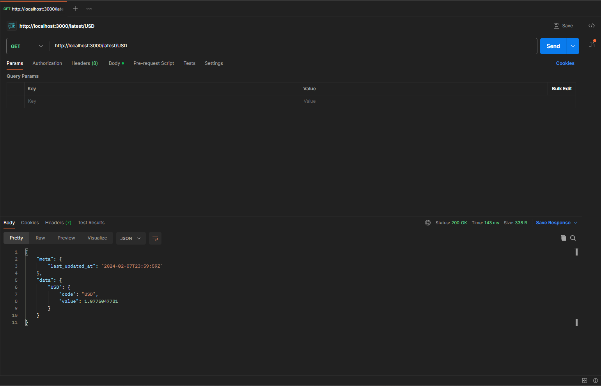
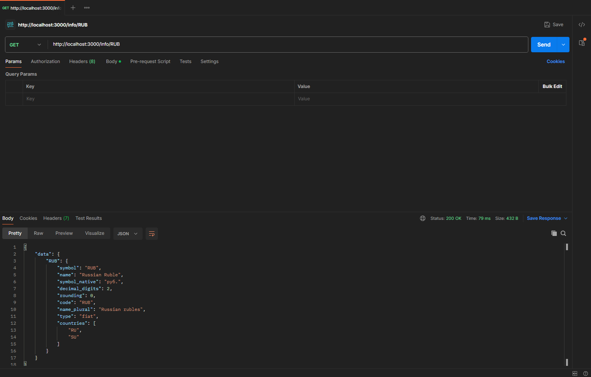
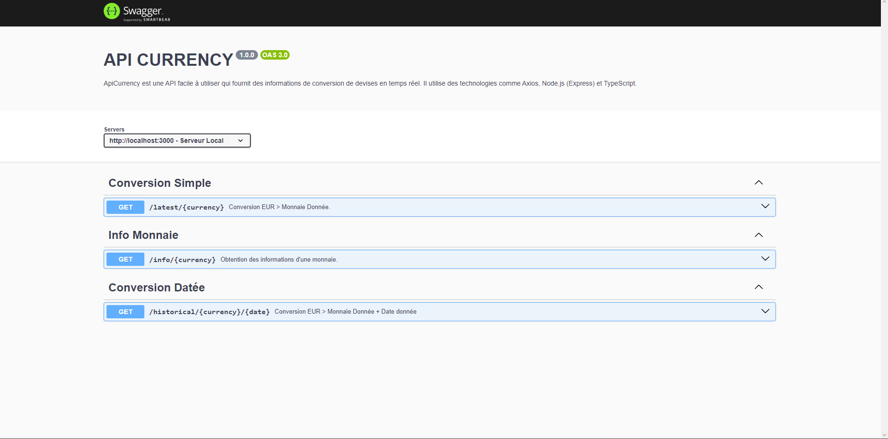

# ApiCurrency : API de conversion de devises
## Description du projet.

ApiCurrency est une API facile à utiliser qui fournit des informations de conversion de devises en temps réel. Il utilise des technologies comme Axios, Node.js (Express) et TypeScript.


## Technologies Utilisées
- Express: Pour le serveur HTTP.
- Axios : Pour effectuer des requêtes HTTP vers des APIs externes.
- TypeScript: Pour le typage statique.
- ts-Node : Pour exécuter directement le code TypeScript dans Node.js.

## Configuration requise
- Node.js : Installé sur votre machine.
- NPM : Pour la gestion des packages.
- TypeScript : Installé globalement ou localement dans votre projet.

## Instruction d'installation
1. Clonez le dépôt : `git clone https://github.com/ismaa2k/Project_API.1-B2`

2. Initialise TypeScript
```bash
npx tsc --init
```

3. Installez les dependencies
```bash
npm install express
npm i axios
npm install --save-dev typescript ts-node
npm i --save-dev @types/express
```
4. Ajouter "start" dans "script" dans le package.json
```bash
"start": "nodemon --exec ts-node server.ts"
```
5. Démarrer le serveur
```bash
npm sart
```

## Utilisation

Voici 2 exemple d'utilisation de notre API. Pour obtenir les taux de change actuels ou des informations sur une devise spécifique, utilisez les routes suivantes :

- `/latest/:currency` pour obtenir la conversion actuelle par rapport à l'euro.



- `/info/:currency` pour obtenir des informations détaillées sur une devise spécifique.



__Remarque : Utilisez les abréviations standard des devises, par exemple EUR pour l'euro, USD pour le dollar américain, etc.__

## Avec Postman

Pour tester l'API, vous pouvez utiliser [Postman](https://www.postman.com/downloads/). Configurez simplement votre requête et pointez vers `http://localhost:3000/latest/USD` pour tester la conversion ou vers `http://localhost:3000/info/RUB` pour obtenir des informations sur la devise.

## Avec Swagger

Pour tester l'API avec Swagger, démarrez le serveur avec `npm start`. Puis allez sur l'url : `http://localhost:3000/api-docs`



## Note Importante
Pour toutes les conversions effectuées via ApiCurrency, l'euro (EUR) est utilisé comme monnaie de référence par défaut. Cela signifie que lorsque vous faites une requête pour obtenir le taux de change actuel ou l'historique des taux, les valeurs sont calculées par rapport à l'euro.